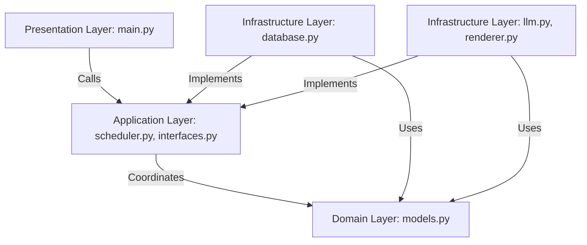
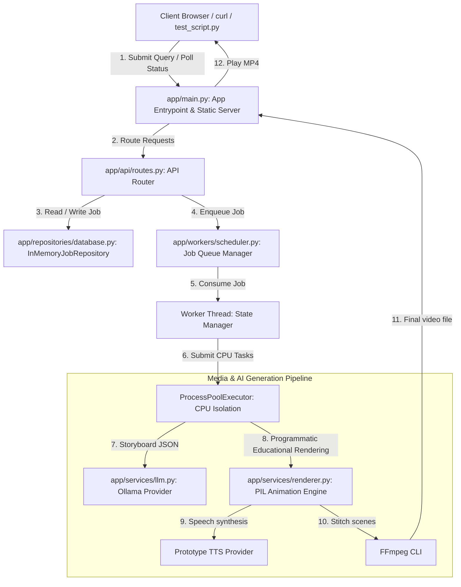
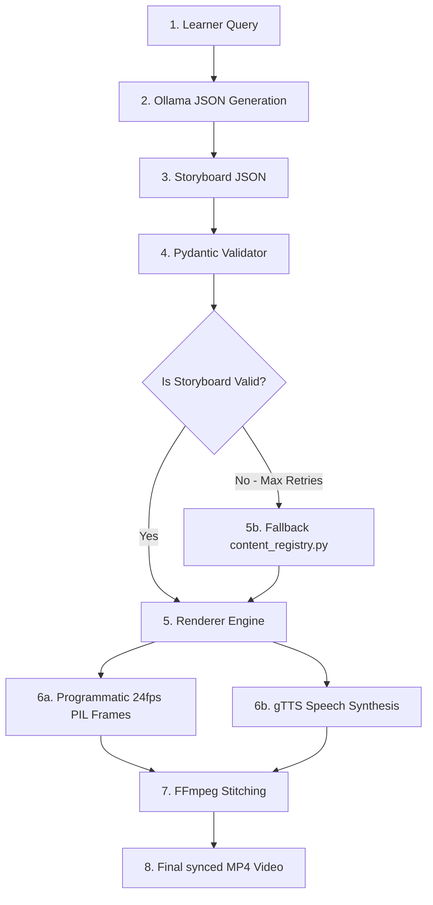
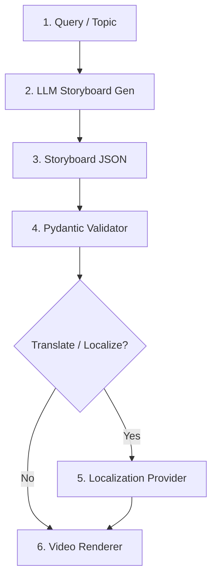
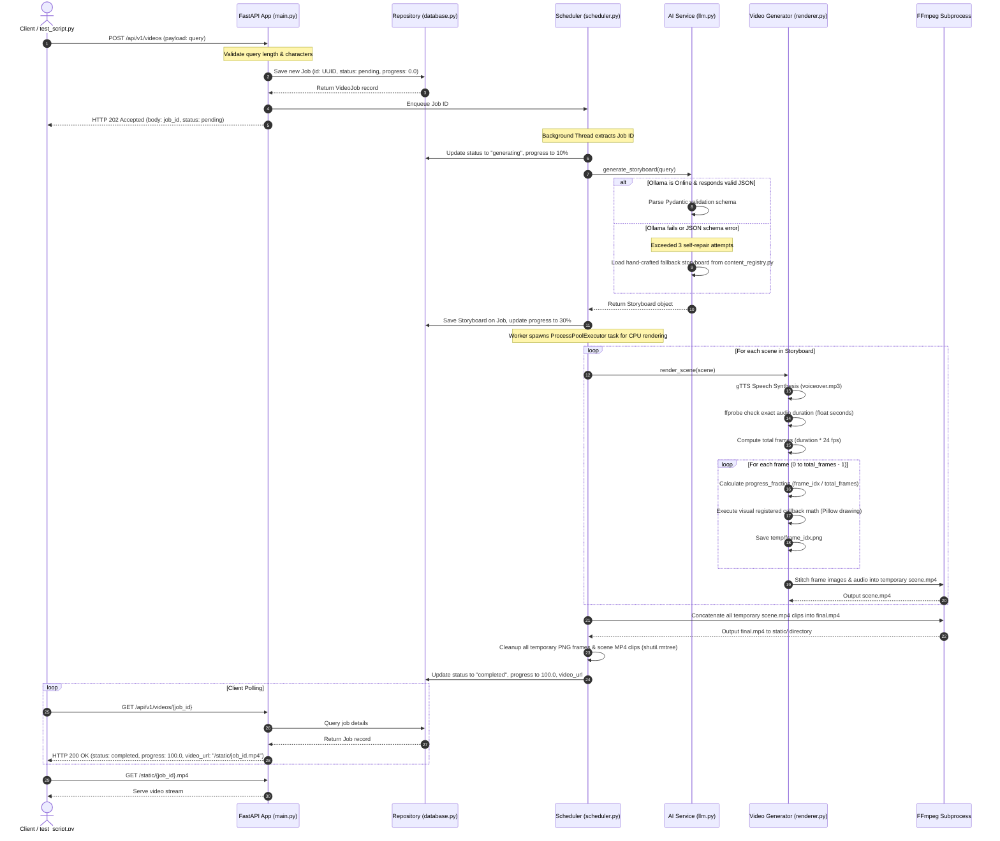
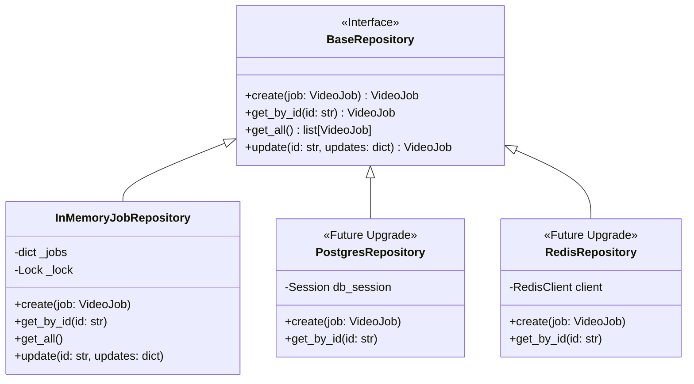
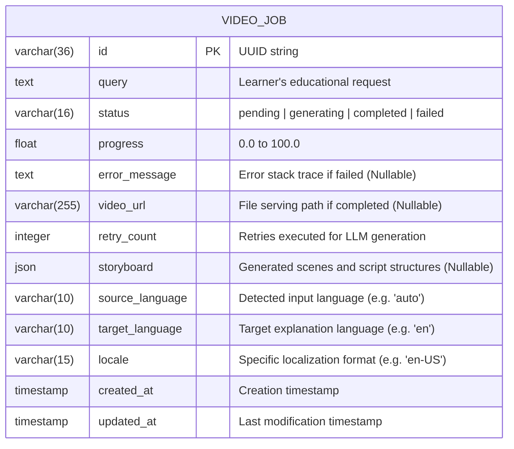

# AI Educational Video Request Service (Chemistry Prototype)
## Implementation Plan

**Prepared by**: Manikumar Pokala (AI Engineer)  
**GitHub**: [https://github.com/ManikumarPokala](https://github.com/ManikumarPokala)  
**Email**: [manikumarp183@gmail.com](mailto:manikumarp183@gmail.com)  
**Submission**: Growtrics Backend Engineering Challenge  

---

## Solution Overview
We are building a robust backend prototype for an AI-native educational video request service, strictly adhering to the following scenario:
- **Client Submission**: A client submits a learning request via a REST API endpoint.
- **Asynchronous Execution**: The backend handles this as a background educational video-generation job. Latency is not a constraint; the video does not generate instantly.
- **State Polling**: The client can query the job status at any time to monitor progress. The backend handles and exposes the waiting state cleanly via the API (using granular states like `pending`, `generating`, `completed`, and `failed`, plus a progress percentage).
- **Purely Backend Focus**: In accordance with the challenge guidelines, **no frontend is built**. Interaction and verification will be demonstrated using auto-generated FastAPI Swagger API docs, `curl` commands, and a lightweight Python client script.

This implementation intentionally focuses on a small but coherent backend slice while documenting clear extension points instead of implementing production infrastructure.

---

## Architectural Decisions

This prototype intentionally optimizes for the following architectural values:
- **Simplicity over Infrastructure Complexity**: Prefers in-process queuing and locked memory persistence to minimize setup friction and dependencies, allowing focus on core job states.
- **Programmatic Educational Rendering over AI Video Generation**: Uses programmatic 24fps drawings combined with synthesized voice clips to ensure repeatable, consistent, and visually clean educational content, eliminating the unpredictable quality of current generative video models.
- **Low Operational Cost**: Leverages local open-source models (Ollama) and local Python rendering, preventing massive API cost run-ups.
- **Clear Separation of Concerns**: Decouples API handlers, database access, background executors, and rendering providers behind strict interfaces.
- **Fail Fast & Self-Heal**: Storyboard JSON schemas are validated immediately at the entry point using Pydantic, triggering automated repair loops before scheduling rendering cycles.
- **Prototype First**: This implementation intentionally delivers the smallest coherent backend slice that satisfies the challenge while preserving clear extension points for production evolution.

---

## Implemented Success Metrics

| Goal Dimension | Optimization Target | Prototype Mechanism |
|---|---|---|
| **Reliability** | Consistent output quality | Pydantic schema validation + 3x LLM repair loops + predefined fallback storyboards. |
| **Cost Control** | Sub-cent per-video compute cost | Locally hosted Ollama + lightweight prototype speech provider + Pillow drawings. |
| **Visual Quality** | Consistent, readable educational content | Programmatic vector drawing callbacks + automated FFprobe validation (framerate, codecs, limits). |
| **Simplicity** | Minimal deployment overhead | Thread-safe in-memory repository + in-process thread-safe background workers. |
| **Extensibility** | Future-proof STEM subjects / APIs | Layered project structure + registry pattern drawings + generic abstract providers. |

---

## AI-Assisted Development Workflow

To satisfy the agentic collaboration requirements, our development pipeline is driven by an iterative, human-in-the-loop AI programming workflow:
1. **Define Architecture & Contracts**: Collaborative design of Pydantic models, OpenAPI routes, and abstract interface contracts.
2. **Generate Isolated Modules**: Build components (routing, repository, background queue, visual drawing registers) independently to minimize context drift.
3. **Inspect & Correct Generated Code**: Manual verification of generated code blocks to check lock structures, path traversal checks, and subprocess error handlings.
4. **Refine Prompts**: Adjust instructions based on initial test results (e.g. refining Ollama JSON parameters, adjusting PIL frame layouts).
5. **Verify Lifecycle End-to-End**: Run automated tests checking job states (pending -> generating -> completed/failed).
6. **Final Content Render**: Submit required chemistry queries to generate and save MP4s.

---

## Domain Agnostic Architecture Note
> [!NOTE]
> Although this prototype specifically implements and generates visual assets for the three required chemistry queries, the underlying platform architecture is fully domain-agnostic. Additional subjects (such as physics, mathematics, or biology) can be added simply by registering new visual drawers and storyboard definitions. The core job scheduler, API routing, audio-synthesis, and FFmpeg concatenation pipelines remain completely unchanged.

## Global Language Support
> [!NOTE]
> Although this prototype generates English educational videos for the three required chemistry topics, the architecture is designed to support multilingual educational content without changes to the core pipeline.

The video generation pipeline separates language processing from rendering, allowing future support for multiple languages through pluggable localization and Text-to-Speech providers. Core rendering, scheduling, storage, and artifact management remain language-independent.

---

## Architecture Principles

The implementation follows these industry-standard architectural principles to guarantee quality and scalability:
- **Clean Architecture**: Decouples business logic from external frameworks, APIs, and file-system operations.
- **SOLID Principles**: Enforces strict boundaries (e.g. Single Responsibility for rendering, Open-Closed for adding visual drawers).
- **Dependency Inversion**: High-level scheduling and worker logic depend on abstract provider interfaces, not concrete implementations.
- **Repository Pattern**: Abstracts database queries behind a uniform interface, allowing storage backends to be swapped out without affecting routing logic.
- **Provider Pattern**: Wraps AI-generation services (LLM, TTS, Localization) behind clear contracts to easily switch between local (Ollama) and cloud APIs (OpenAI, Anthropic).
- **Fail Fast**: Validates inputs (Pydantic) and storyboards early before wasting heavy GPU/CPU rendering resources.
- **Idempotency by Design**: Deduplicates duplicate inputs to prevent duplicate video rendering tasks.
- **Observable by Default**: Provides structured logging and progress updates at every stage of the lifecycle.
- **Localization Ready**: Language processing is separated from rendering and business logic, enabling multilingual support and regional adaptation without modifying the core generation pipeline.
- **Quality by Verification**: Generated artifacts are validated using automated structural, rendering, and media integrity checks before being exposed to clients.

---

## Codebase Layering & Project Structure

To maintain clean separation of concerns, the codebase is structured around a four-tier architecture:

```
Presentation Layer (API Routers, Static Serving)
  └── main.py
       │
       ▼
Application Layer (Task Scheduling, Job Workers, Interfaces)
  ├── services/scheduler.py
  └── services/interfaces.py
       │
       ▼
Domain Layer (Business Logic Entities, Pydantic Schemas, Fallbacks)
  ├── models.py
  └── storyboards/content_registry.py
       ▲
       │
Infrastructure Layer (Database Repository, AI Connectors, Rendering Engines)
  ├── database.py
  ├── services/llm.py
  └── services/renderer.py
```

### Dependency Flow Diagram

This diagram shows that the core business models (Domain Layer) have zero dependencies on outer layers, and outer layers (Infrastructure, Presentation) depend on interfaces defined in the Application Layer:



---

## Extension Points

The platform is designed with clear extension hook points to future-proof the codebase:
- **New LLM Provider**: Implement the `ILLMProvider` interface to integrate OpenAI, Claude, or Gemini.
- **New TTS Engine**: Implement the `ITTSProvider` interface to swap in ElevenLabs or Azure Speech.
- **New Localization Provider**: Implement the `ILocalizationProvider` interface to support Google Cloud Translation, DeepL, Azure Translator, Amazon Translate, or other localization/locale-formatting services.
- **New Educational Module**: Register new storyboard templates and rendering callbacks for additional subjects (Physics, Biology, Mathematics, History, Programming, Finance, etc.) without modifying the core pipeline.
- **New Rendering Engine**: Swap the visual rendering layer from Pillow to SVG, Manim, HTML5 Canvas, WebGPU, or Three.js without changing business logic.
- **New Storage Backend**: Extend the `BaseRepository` interface to store metadata in PostgreSQL, MongoDB, or Firestore.
- **New Queue Runner**: Replace the `ProcessPoolExecutor` with Celery and Redis to scale tasks across separate compute clusters.
- **New Output Specs**: Modify configuration parameters to compile videos at higher resolution (e.g., 1080p, 4K) or different aspect ratios (e.g., 9:16 vertical shorts).

---

## Engineering Trade-offs

To satisfy the requirements of a 90-120 minute backend prototype while ensuring a path to production, we make the following intentional engineering tradeoffs:

| Choice | Status | Reason |
|---|---|---|
| **In-Memory Repository** | **Chosen** | Simplifies local prototype startup and eliminates external database installation, while preserving repository abstractions. |
| **ProcessPoolExecutor Queue** | **Chosen** | Bypasses the Python GIL for CPU-bound Pillow rendering without introducing Celery/Redis dependencies. |
| **Local Artifact Storage** | **Chosen** | Stores final MP4 files in a `/static` directory served directly by FastAPI, simplifying local playback. |
| **Programmatic Educational Rendering** | **Chosen** | Provides deterministic, repeatable, and consistent educational visuals using programmatic rendering rather than probabilistic video generation. |
| **In-Process Task Queue** | **Chosen** | We intentionally use a lightweight in-process worker queue instead of Celery/Redis because the challenge explicitly allows in-memory persistence and our objective is to demonstrate clean architectural boundaries rather than managing distributed infrastructure. |
| **Prototype TTS Provider** | **Chosen** | Ideal for zero-cost prototype speech generation, packaged behind a provider abstraction so it can be swapped with ElevenLabs, Azure Speech, or Google Cloud TTS in production. |
| **Distributed Broker / DB** | *Not Chosen* | Swapping in Redis, Celery, PostgreSQL, or S3 is deferred to production, as they add deployment overhead that is out of scope for a local prototype. |

---

## Video Quality Assurance

Every generated video passes through a quality verification pipeline before it is marked as `completed`. The verification process ensures the generated artifact satisfies functional, visual, and technical quality requirements.

### 1. Validation Stages

1. **Storyboard Validation**:
   - Storyboard conforms to the expected Pydantic schema.
   - Every scene contains narration, duration, and visual type.
   - No empty or invalid scenes.
2. **Rendering Validation**:
   - Every expected frame is successfully generated in `/temp`.
   - No corrupted or missing frame files.
   - Frame count matches the computed duration.
3. **Audio Validation**:
   - Speech synthesis completes successfully.
   - Audio file is readable and non-corrupted.
   - Audio duration matches storyboard timing.
4. **Video Validation (Automated FFprobe Audits)**:
   - FFmpeg exits successfully with code `0`.
   - Prior to marking the job as complete, the generated MP4 is verified using **FFprobe** via a subprocess to ensure:
     - **Container**: Valid MP4 package container.
     - **Codecs**: H.264 video track and AAC audio track present.
     - **Duration**: Expected total audio/video length is verified.
     - **Resolution**: Dimensions match exactly `1280x720`.
     - **FPS**: Compiled framerate is exactly `24 FPS`.
5. **Content Validation**:
   - Generated visuals match the storyboard registered drawers.
   - Narration script matches synthesized outputs.
   - Transition checkpoints align correctly between scenes.

### 2. Video Quality Score Matrix

To dynamically determine if a compiled video meets quality thresholds, we apply a weighted validation scorecard logic. A total score of **90%+** is required to publish/complete the artifact; otherwise, the task triggers a retry or falls back to standard templates:

| Validation Dimension | Weight | Objective Checklist Metrics |
|---|---|---|
| **Story Accuracy** | 30% | Learner query connects logically to storyboard script terms. |
| **Rendering Success** | 20% | 100% of frames rendered without disk write errors or exceptions. |
| **Audio Synchronization** | 20% | Voiceover length matches visual frame count (within $\pm$ 200 ms). |
| **Visual Integrity** | 15% | Dimensions are verified, and elements lie within safe visual margins. |
| **Technical Validation** | 15% | FFprobe confirms valid MP4 container, H.264/AAC codecs, and 24fps. |
| **Total Target** | **100%** | **Score $\ge$ 90% transitions job to completed; else retries/fails.** |

---

## Assumptions

Our architectural design is based on the following project assumptions:
- **Scope Limit**: The prototype only requires supporting the 3 specified chemistry queries.
- **Job Constraints**: A job processes one video per request, with a maximum video duration of 30 seconds.
- **Artifact Storage**: Videos are saved locally in the server's workspace directories and served directly.
- **Scale**: Deployment runs on a single node (single container instance) for the initial prototype.
- **Access Control**: No user authentication or authorization is required for the demo.
- **Queue Limits**: A single background queue runs with one active CPU rendering worker thread.

---

## Non-Functional Requirements (NFRs)

| NFR Domain | Metric / Constraint | Target Standard |
|---|---|---|
| **Availability** | System Uptime | 99% availability of FastAPI endpoints |
| **API Latency** | Submission Response | `POST /api/v1/videos` responds in `< 300ms` |
| **API Latency** | Status Polling | `GET /api/v1/videos/{job_id}` responds in `< 100ms` |
| **Memory Limit** | Compute footprint | `< 512MB` RAM usage per video rendering job |
| **Video Quality**| Resolution & FPS | Exactly `1280x720` (720p HD) at `24` frames per second |
| **Video Format** | Codec & Container | H.264 video streams, AAC audio tracks, packaged in MP4 container |
| **Retention** | Artifact cleanup | Output videos are retained on disk for `7 days` |
| **Queue Limit**  | Worker Backlog | Maximum in-memory job queue backlog is `100 jobs` |
| **Localization** | Language Support | Pluggable language pipeline with provider abstraction |

---

## Design Patterns Used

- **Repository Pattern**: Used in `database.py` to decouple state management from main routes.
- **Provider Pattern**: Abstracting Ollama/gTTS/Localization/FFmpeg interactions so they are easily replaced by cloud alternatives.
- **Registry Pattern**: Decorator-based drawer mapping (`@register_drawer(visual_type)`) allowing modular extensions of rendering modules.
- **Strategy Pattern**: Selecting rendering strategies dynamically depending on the storyboard visual type.
- **Factory Pattern**: Creating the appropriate LLM provider depending on environmental configurations.
- **Dependency Injection**: Injecting configuration settings and repositories into FastAPI routers.
- **Adapter Pattern**: Wrapping the system `ffmpeg` command-line interface in a Python class.

---

## Product Requirements Mapping

To ensure complete alignment, here is how our backend design maps to each product requirement:

| Requirement | Implementation Detail | Location |
|---|---|---|
| **FastAPI Backend** | FastAPI application setup with dynamic Swagger documentation. | API Layer |
| **Request endpoint** | `POST /api/v1/videos` accepting query payload. | API Layer |
| **Async generation** | Dedicated thread-safe queue executor for background rendering. | Background Worker |
| **List jobs** | `GET /api/v1/videos` retrieving all job records. | API Layer |
| **Visible job status** | `GET /api/v1/videos/{job_id}` returning state, progress, and error details. | API Layer |
| **Retrieve artifact** | Static file serving route `/static/{job_id}.mp4` for direct playback. | API Layer |
| **Visual & Audio Video** | 24fps frame-by-frame rendering with Pillow and the configured TTS provider. | Rendering Service |
| **Clear Boundaries** | Decoupled layers: API Layer, State schemas, Repository persistence, Background worker execution, Renderer and AI Generation services. | Project Structure |
| **Cost & Quality** | Uses locally hosted Ollama + prototype speech provider (or offline synth) + Pillow. Extremely low cost-per-video with 720p HD crisp vector outputs. | Rendering Service |
| **Reliability / Evals** | **Quality Assurance**: Every generated artifact passes schema validation, media verification (FFprobe), and quality checks before the job transitions to completed. | AI Provider |

---

## System Architecture

### Component Diagram

The following component layout highlights the boundaries between the API routing layer, the background queue state engine, the database repository, and the process-isolated video rendering pipeline.



### AI Generation Pipeline

This diagram shows the sequential transformations applied to a learner's query to compile it into a final educational video:



### Language Processing Pipeline

For future multilingual deployment, the localization flow inserts a translation and adaptation boundary *after* the storyboard schema is successfully validated, ensuring language-specific script terms and voice selection align prior to rendering:



### Async Sequence Flow



---

## Database Design

### Repository Interface Hierarchy
To ensure storage scalability, the database module utilizes strict interface abstractions. BaseRepository is declared in app/repositories/database.py and implemented by InMemoryJobRepository, facilitating painless migrations from local RAM to Postgres or Redis:



### Entity Schema Definition
The database entity structure includes language and localization settings to represent a localization-ready database model:



---

## OpenAPI V1 Contract Specification

### Error Catalog

| Error Key | HTTP Code | Meaning / Scenario |
|---|---|---|
| `INVALID_QUERY` | 400 Bad Request | Learner request query length `< 10` or `> 200` characters, or contains unsafe characters |
| `JOB_NOT_FOUND` | 404 Not Found | Requested Job ID does not exist in repository dictionary |
| `VIDEO_NOT_READY` | 409 Conflict | Requesting video static download while job is in `generating` or `pending` state |
| `RATE_LIMITED` | 429 Too Many Requests | Client exceeded 5 video requests per minute limit |
| `GENERATION_FAILED` | 500 Internal Error | Unrecoverable rendering or compilation crash in worker process |

### Endpoint Schemas

#### 1. `POST /api/v1/videos`
- **Request Body**:
```json
{
  "query": "Why do atoms form covalent bonds?",
  "source_language": "auto",
  "target_language": "en",
  "locale": "en-US"
}
```
- **Response (HTTP 202 Accepted)**:
```json
{
  "id": "e0a4f5f5-ef85-45cf-a3be-5a12d1b2ef3a",
  "query": "Why do atoms form covalent bonds?",
  "status": "pending",
  "progress": 0.0,
  "error_message": null,
  "video_url": null,
  "retry_count": 0,
  "storyboard": null,
  "source_language": "auto",
  "target_language": "en",
  "locale": "en-US",
  "created_at": "2026-07-08T16:21:06.123456",
  "updated_at": "2026-07-08T16:21:06.123456"
}
```

#### 2. `GET /api/v1/videos/{job_id}`
- **Response (HTTP 200 OK - Processing)**:
```json
{
  "id": "e0a4f5f5-ef85-45cf-a3be-5a12d1b2ef3a",
  "query": "Why do atoms form covalent bonds?",
  "status": "generating",
  "progress": 60.0,
  "error_message": null,
  "video_url": null,
  "retry_count": 0,
  "storyboard": {
    "scenes": [
      {
        "visual_type": "covalent_bond",
        "script": "Covalent bonding occurs when two non-metals share electrons to achieve a stable shell.",
        "duration": 5.2
      }
    ]
  },
  "source_language": "auto",
  "target_language": "en",
  "locale": "en-US",
  "created_at": "2026-07-08T16:21:06.123456",
  "updated_at": "2026-07-08T16:21:11.789123"
}
```

---

## Core Service Provider Interfaces

Our provider hierarchy separates domain logic from service integration, declaring clean interface contracts for every outer service resource:

```python
# interfaces.py
from abc import ABC, abstractmethod
from pydantic import BaseModel

class StoryboardScene(BaseModel):
    visual_type: str
    script: str
    duration: float

class Storyboard(BaseModel):
    scenes: list[StoryboardScene]

class ILLMProvider(ABC):
    @abstractmethod
    async def generate_storyboard(self, query: str) -> Storyboard:
        """
        Request storyboard from LLM, perform validation, and handle retries.
        """
        pass

class ILocalizationProvider(ABC):
    @abstractmethod
    async def localize_storyboard(self, storyboard: Storyboard, target_lang: str, locale: str) -> Storyboard:
        """
        Translate and adapt storyboard scripts and parameters based on target locale.
        """
        pass

class ITTSProvider(ABC):
    @abstractmethod
    async def synthesize_speech(self, text: str, output_path: str, locale: str) -> str:
        """
        Generate audio speech file for the scene matching the locale. Return file path.
        """
        pass

class IVideoRendererProvider(ABC):
    @abstractmethod
    def draw_scene_frames(self, scene: StoryboardScene, audio_path: str, temp_dir: str) -> str:
        """
        Calculate animation frames, render images, and stitch into scene MP4. Return scene file path.
        """
        pass

class IStorageProvider(ABC):
    @abstractmethod
    def upload_artifact(self, local_path: str, filename: str) -> str:
        """
        Upload final video to artifact storage (GCS/S3) and return public URL.
        """
        pass

class IQueueProvider(ABC):
    @abstractmethod
    def push_job(self, job_id: str) -> None:
        """
        Queue job execution.
        """
        pass
```

---

## Retry Policy, Idempotency & Failure Recovery

- **Ollama Self-Repair Policy**: Storyboards generated by Ollama are validated using Pydantic. If validation fails, a repair prompt containing the schema violation is sent back to the LLM up to 3 times. If it still fails, the system loads fallback hand-crafted storyboard records.
- **Idempotency Check**: Normalizes learner query text, computes MD5 hash, and links matching completed query requests directly to existing `.mp4` files rather than running rendering pipelines again.
- **Clean Failure purges**: Intercepts rendering errors, logs exceptions, updates state status as `failed` with stack details, and executes cleanup processes (`shutil.rmtree`) in `finally` blocks to delete temporary directories immediately.

---

## Security Considerations

- **Input Validation**: API payload input constraints are configured using Pydantic: length must be `10 <= query <= 200` characters, restricting special symbols.
- **Path Traversal protection**: The `/static/` media endpoint uses FastAPI's `StaticFiles` built-in safe resolver. Internal directories map paths strictly by validating UUID-form parameters.
- **API Rate Limiting**: Implements basic in-memory rate-limiting middleware, restricting clients to **5 requests per minute** to prevent queue flooding.

---

## Performance, Concurrency & Scalability

- **GIL Bypass (Process Isolation)**: Pillow rendering computations are completely offloaded to a separate `ProcessPoolExecutor` with `max_workers = min(2, cpu_count)`. This keeps main event loop threads available to serve REST updates without latency spikes.
- **FFmpeg Thread Limits**: Launches FFmpeg tasks restricted to `-threads 2` to prevent subprocess allocations from starving server core availability.

### Expected Throughput & Resource Scaling

- **Single Worker Profile**:
  - *Queue execution*: One active rendering process runs at a time. Multiple requests are queued in the background thread. Status polling remains concurrent and non-blocking.
  - *Average Render duration*: 20 to 40 seconds per video.
  - *Memory footprint*: $\approx$ 250MB RAM per generation job.
  - *CPU usage*: 2 CPU cores maximum per generation job.
- **Horizontal Scaling Estimates (Future Production Upgrade)**:
  - `1 Worker Container`: Handles 1 active job and queues backlogs smoothly.
  - `10 Worker Containers` (Distributed via Celery): Processes 10 active parallel rendering streams.
  - `100 Worker Containers` (Auto-scaled on GCP/AWS Cloud Run): Renders up to 100 active parallel video requests.

---

## Production Cost Breakdown

### Illustrative Production Estimate

| Component | Cost per Video | Description |
|---|---|---|
| **LLM Storyboard** | $\$0.00075$ | 1000 input + 1000 output tokens on GPT-4o-mini / local Ollama is $\$0.00$ |
| **TTS Speech** | $\$0.00800$ | Google TTS pricing ($\$16$ per million characters) / local prototype speech provider is $\$0.00$ |
| **CPU Rendering** | $\$0.00025$ | compute execution container allocation (~15s) |
| **Storage & CDN** | Negligible | S3 storage and edge caching delivery |
| **Total Per Video** | **$\approx \$0.009$ (under 1 cent)** | **Highly cost-conscious production design** |

---

## Deployment Architecture

### 1. Dockerfile
We utilize a multi-stage, slim debian base that bundles FFmpeg and essential libraries:

```dockerfile
FROM python:3.12-slim
WORKDIR /app
RUN apt-get update && apt-get install -y --no-install-recommends \
    ffmpeg \
    fonts-liberation \
    && rm -rf /var/lib/apt/lists/*
COPY requirements.txt .
RUN pip install --no-cache-dir -r requirements.txt
COPY . .
EXPOSE 8000
CMD ["uvicorn", "main:app", "--host", "0.0.0.0", "--port", "8000"]
```

### 2. Illustrative Production Evolution
For scaling to production, the architecture migrates to Google Cloud Platform (GCP) or AWS:

```
[ HTTPS Traffic ] ---> [ GCP Load Balancer ] ---> [ Cloud Run (FastAPI API Web Node) ]
                                                            |
                                                   (Push Job Metadata)
                                                            v
[ Cloud Run Worker ] <--- (Pull Task) <--- [ GCP Cloud Tasks / Pub-Sub Queue ]
        |
   (Read/Write) ---> [ Cloud SQL (PostgreSQL) ]
        |
  (Generate MP4) ---> [ Google Cloud Storage Bucket ] ---> [ CDN Edge ] ---> [ User Download ]
```

---

## Configuration Management (`.env` file)
```ini
APP_ENV=development
PORT=8000
HOST=0.0.0.0

OLLAMA_HOST=http://localhost:11434
OLLAMA_MODEL=qwen2.5:7b

VIDEO_RESOLUTION_W=1280
VIDEO_RESOLUTION_H=720
VIDEO_FPS=24

RATE_LIMIT_PER_MIN=5
MAX_RETRIES=3
```

---

## Logging, Observability & Monitoring
- **Structured JSON logging**: Configured using standard library wrappers to emit logs directly to stdout, enabling clean ingestion by Cloud Logging / Datadog.
- **Monitoring telemetry**: Tracks metric counters for `video_jobs_created_total`, `video_jobs_failed_total`, and histograms for `video_generation_duration_seconds`.

---

## Tech Stack & Folder Structure
- **Tech Stack**: FastAPI, Pillow (PIL), Prototype TTS Provider (gTTS), FFmpeg, Ollama.

```
growtrics-ai-video-request-service/
├── app/
│   ├── __init__.py
│   ├── main.py                # FastAPI endpoints entry point
│   ├── api/
│   │   ├── __init__.py
│   │   └── routes.py          # FastAPI routes
│   ├── core/
│   │   ├── __init__.py
│   │   ├── config.py          # Configurations & settings validation
│   │   └── interfaces.py      # Core service provider interfaces
│   ├── models/
│   │   ├── __init__.py
│   │   └── schemas.py         # Pydantic schemas (Job, Request, Storyboard)
│   ├── repositories/
│   │   ├── __init__.py
│   │   └── database.py        # InMemoryJobRepository (Thread-safe)
│   ├── services/
│   │   ├── __init__.py
│   │   ├── llm.py             # Ollama structured JSON integration & retry-repair
│   │   └── renderer.py        # 24fps PIL animation engine & ffmpeg stitcher
│   ├── storyboards/
│   │   ├── __init__.py
│   │   └── content_registry.py # Generic registry & Chemistry fallback storyboards
│   └── workers/
│       ├── __init__.py
│       └── scheduler.py       # Asynchronous background job worker (Process pool)
├── requirements.txt           # Project dependencies
├── README.md                  # Setup & run instructions
├── .env.example               # Example configuration keys
├── docs/
│   └── architecture.md        # Architecture overview (for hiring team)
├── assets/
│   └── fonts/
│       └── Roboto-Regular.ttf # Bundled font for OS-agnostic rendering
├── tests/
│   ├── __init__.py
│   └── test_api.py            # Pytest test cases for the API and lifecycle
├── static/                    # Output directory for generated MP4 files
└── temp/                      # Temp frames directory (cleaned up automatically)
```

---

## Proposed Changes (Components)

#### [MODIFY] app/core/config.py
- Setup project configs, paths, and environment variable verifications.

#### [MODIFY] app/models/schemas.py
- Pydantic models for jobs, request payloads, and storyboard schemas.

#### [MODIFY] app/repositories/database.py
- `BaseRepository` interface and thread-safe dictionary implementation (`InMemoryJobRepository`).

#### [MODIFY] app/workers/scheduler.py
- Background worker task queue managing state transitions and `ProcessPoolExecutor` processes.

#### [MODIFY] app/services/llm.py
- Ollama API connector payload integration and structural self-repair parsing loops.

#### [MODIFY] app/services/renderer.py
- **Programmatic educational rendering engine using reusable drawing primitives** (Registry pattern drawer callbacks) generating 24fps PIL frames synced with TTS audio lengths.

#### [MODIFY] app/storyboards/content_registry.py
- Hand-crafted storyboard registry structure managing Chemistry fallbacks, built to scale to Physics, Biology, and other disciplines.

#### [MODIFY] app/main.py & app/api/routes.py
- FastAPI routes setup, static directory server maps, error filters, and rate-limiting wrappers.

---

## Future Roadmap (Production Upgrades)
- **Durable Queues**: Swapping background queues for distributed Celery workers with a Redis broker.
- **Relational Storage**: PostgreSQL storage using SQLAlchemy.
- **Object Storage**: S3/GCS asset uploading for edge CDN caching.
- **Kubernetes**: Container orchestration autoscaling on queue thresholds.
- **Multilingual Video Generation**: Generate educational videos in multiple languages by integrating translation/localization providers and multilingual Text-to-Speech engines while reusing the same storyboard and rendering pipeline.

---

## Risk Register

| Risk | Impact | Likelihood | Mitigation |
|---|---|---|---|
| **Ollama JSON Parser fail** | High | Medium | Enable API `format="json"`, enforce schemas, and fallback to local subject templates after 3 retries. |
| **Google TTS Rate Limiting** | Medium | Medium | Implemented synthesized offline wave tone generator fallback if connection fails. |
| **Pillow GIL CPU lag** | High | Low | Run all PIL frame computations inside a separate `ProcessPoolExecutor` process. |
| **Disk leakage (PNGs)** | High | Medium | Perform all rendering inside job-specific folders and delete them in `finally` blocks. |

---

## Implemented Prototype Topics

Your prototype must support these three learner queries end-to-end:
1. **How does the pH scale work?**
2. **Why do atoms form covalent bonds?**
3. **What is the difference between ionic and covalent bonding?**

---

## Demo Walkthrough Script

Reviewers can verify and reproduce system lifecycle events by following these walkthrough CLI commands:
1. **Launch Server**: `uvicorn app.main:app --reload --port 8000`
2. **Submit Request**:
   ```bash
   curl -X POST http://localhost:8000/api/v1/videos \
        -H "Content-Type: application/json" \
        -d '{"query": "Why do atoms form covalent bonds?"}'
   ```
   *(Collects returned UUID `job_id` and initial `status: pending` response)*
3. **Observe State Transitions**:
   Poll status repeatedly to monitor state updates and progressive percentage ticks (e.g. 10%, 30%, 60%, 80%, 95%):
   ```bash
   curl http://localhost:8000/api/v1/videos/{job_id}
   ```
4. **Download & Play Video**:
   Once status transitions to `completed` and `progress: 100.0`, open the stream link inside your browser or download the file:
   ```bash
   curl -o sample.mp4 http://localhost:8000/static/{job_id}.mp4
   ```

---

## Verification Plan

### Automated Tests
- Create `test_api.py` to test:
  - Job creation.
  - Lifecycle state changes (pending -> generating -> completed/failed).
  - API endpoint responses.
  - Fallback storyboards loading.
- We will run the tests using `pytest`.

### Manual Verification
- Start the server using `uvicorn app.main:app --reload`.
- Run curl commands to request the three required queries.
- Download the generated video files and play them to verify both visual and audio quality.
