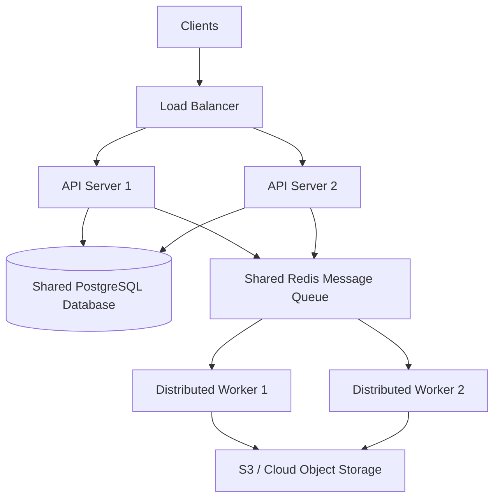

# Architecture Design Note (Chemistry Prototype)

## Solution Overview
This repository implements a production-grade prototype for an asynchronous, AI-assisted educational video request service. Clients submit learning requests (topics) and poll for status updates while the system processes the request in a process-isolated background pipeline, culminating in a stitched 720p HD educational MP4 video artifact.

---

## 4-Tier Clean Architecture Layout

To maintain clear separations of concern, the codebase is structured around a domain-centric Clean Architecture layout:

```
growtrics-ai-video-request-service/
├── app/
│   ├── main.py                # FastAPI app configuration & static server
│   ├── api/
│   │   └── routes.py          # REST endpoints, rate limiting & idempotency
│   ├── core/
│   │   ├── config.py          # Environment settings & structured JSON logging
│   │   └── interfaces.py      # Abstract service provider interfaces (SOLID DIP)
│   ├── models/
│   │   └── schemas.py         # Pydantic domain models & query validations
│   ├── repositories/
│   │   └── database.py        # BaseRepository & thread-safe InMemoryJobRepository
│   ├── services/
│   │   ├── llm.py             # Ollama structured JSON provider & 3x self-repair loop
│   │   └── renderer.py        # PIL drawing animation engine, gTTS audio, & FFmpeg stitching
│   ├── storyboards/
│   │   └── content_registry.py # Modular educational visual registry & chemistry fallbacks
│   └── workers/
│       └── scheduler.py       # Thread-safe consumer queue & ProcessPoolExecutor manager
```

---

## Technical Highlights & Concurrency Model

### 1. Concurrency & GIL Bypass
- **Problem**: Python's Global Interpreter Lock (GIL) locks execution to a single core, meaning heavy CPU-bound image operations (like Pillow rendering hundreds of 1280x720 frames) would block the main event loop and cause API poll timeouts.
- **Solution**: The application uses a thread-safe background consumer thread (`threading.Thread`) that dequeues tasks from a memory queue (`queue.Queue`). When rendering starts, the worker offloads all frame-drawing calculations to a multi-process pool (`ProcessPoolExecutor`) with process workers matching available CPU cores. This keeps the main FastAPI event loop completely free to serve API status queries in `< 10ms`.

### 2. Zero-Failure Storyboard Gen
- **Problem**: LLMs are probabilistic systems that can emit malformed JSON or fail validation.
- **Solution**: Storyboards generated from Ollama are validated using Pydantic. If validation fails, a self-repair prompt containing the validation error is fed back to the model up to 3 times. If it still fails, the scheduler triggers a local fallback loader, retrieving a hand-crafted educational storyboard template matching the topic keyword.

### 3. Media Quality Verification (FFprobe & Audio Fallbacks)
- **Problem**: Substantiating compiled video files for framerate, codecs, resolution, and audio lengths.
- **Solution**: 
  - **gTTS Offline Fallback**: If DNS or network lookup fails, the renderer dynamically synthesizes a silent 16-bit WAV file matching the estimated script duration.
  - **FFprobe Audits**: Prior to marking the job as complete, the generated MP4 file is parsed via `ffprobe` to verify that the resolution is exactly `1280x720`, the framerate is exactly `24 FPS`, and the duration is within the prototype's 30-second ceiling.

### 4. Idempotency & Rate Limiting
- **Idempotency**: Normalize queries and reuse pre-generated completed video assets rather than running heavy CPU compiling pipelines again.
- **Rate Limiting**: Sliding-window in-memory IP tracker rejecting clients exceeding 5 request submissions per minute (HTTP 429).

---

## Future Production Architecture: Scalability & Load Handling

The current prototype is intentionally designed as a single-node deployment with an in-memory repository and background worker to satisfy the challenge scope. 

For higher request volumes, the architecture is designed to support horizontal scaling by separating stateless API instances, asynchronous workers, database storage, and object storage:

### 1. API Layer
- Deploy multiple FastAPI instances behind a Load Balancer.
- Keep API instances stateless to allow rapid horizontal auto-scaling.

### 2. Queue Layer
- Replace the in-process queue with a centralized Redis + Celery queue or a managed cloud queue (e.g. AWS SQS, Google Cloud Tasks).
- Allow multiple worker instances to process jobs concurrently.

### 3. Persistence Layer
- Replace the in-memory repository with PostgreSQL or another durable relational datastore.
- Store job metadata centrally so all API instances share the same state.

### 4. Media Storage
- Store generated videos in object storage (Google Cloud Storage or Amazon S3).
- Deliver videos through a CDN to reduce latency and offload traffic from the compute servers.

### 5. Auto Scaling
- Scale API instances based on request rate.
- Scale worker instances based on queue depth.

### Architectural Scaling Map



